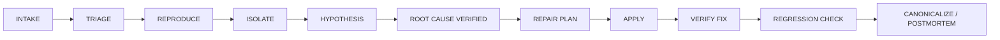

  

# Dr.Debug

**Dr.Debug** is an evidence-routed software and hardware debugging system for fault intake, reproduction, isolation, root-cause analysis, mitigation, controlled repair, verification, regression prevention, preservation, and reusable diagnostic knowledge.

> Preserve the difference between observation, hypothesis, verified root cause, workaround, repair, and verified repair. Scope every reusable claim to the relevant device, software, firmware, dependency, environment, version, and evidence.

## Repository map

| Area | Repository | Purpose |
|---|---|---|
| Organization profile | [`doktor-debug/.github`](https://github.com/doktor-debug/.github) | Public organization overview and repository navigation. |
| Agent governance | [`doktor-debug/.agents`](https://github.com/doktor-debug/.agents) | Global Dr.Debug instructions, modes, diagnostic lifecycle, routing, and gates. |
| Dr.Debug API namespace | [`doktor-debug/.api`](https://github.com/doktor-debug/.api) | Project-specific API contracts and behavior under `/doktor-debug/**`. |
| Diagnostic memory | [`doktor-debug/.memory`](https://github.com/doktor-debug/.memory) | Accepted evidence-linked observations and textual diagnostic knowledge. |
| Canonical knowledge | [`doktor-debug/.canonical`](https://github.com/doktor-debug/.canonical) | Reviewed root causes, facts, methods, conflicts, and supersede lineage. |
| Research | [`doktor-debug/.research`](https://github.com/doktor-debug/.research) | Sources, evidence grading, contradictions, reproducibility, and rights context. |
| Taxonomy | [`doktor-debug/.taxonomy`](https://github.com/doktor-debug/.taxonomy) | Stable device/software/dependency classification and relationships. |
| Scanner | [`doktor-debug/.scanner`](https://github.com/doktor-debug/.scanner) | Untrusted artifact intake, inventory, risk assessment, and routing. |
| Import staging | [`doktor-debug/.import`](https://github.com/doktor-debug/.import) | Controlled extraction/import staging with provenance preservation. |
| Proposals | [`doktor-debug/.proposals`](https://github.com/doktor-debug/.proposals) | Unresolved corrections, repair candidates, and reviewable structural proposals. |
| Workflows | [`doktor-debug/.workflows`](https://github.com/doktor-debug/.workflows) | Repair playbooks, validation sequences, migrations, automation, and rollback. |
| Archive | [`doktor-debug/.archive`](https://github.com/doktor-debug/.archive) | Preservation catalog, provenance, hashes, snapshots, and distribution decisions. |
| Storage | [`doktor-debug/.storage`](https://github.com/doktor-debug/.storage) | Large-artifact integrity, retention, restore, access, and delivery metadata. |
| Private web source | [`doktor-debug/.web`](https://github.com/doktor-debug/.web) | Sanitized presentation/render source; never a second diagnostic truth. |
| Wiki | [`doktor-debug/wiki`](https://github.com/doktor-debug/wiki) | Public human-readable architecture and diagnostic documentation. |
| Pages release target | [`doktor-debug/doktor-debug.github.io`](https://github.com/doktor-debug/doktor-debug.github.io) | Deliberately generated/sanitized public Pages output; not canonical private source. |

## API boundary

Dr.Debug uses two cooperating layers:

- [`doktor-debug/.api`](https://github.com/doktor-debug/.api) owns Dr.Debug-specific routes and contracts under **`/doktor-debug/**`**.
- [`n-e-o-w-u-l-f/myAPI`](https://github.com/n-e-o-w-u-l-f/myAPI) is the shared external gateway/control plane for **`/`**, shared health/system information, cross-project API discovery, shared authentication/owner resolution, audit, and dispatch.

The project API must integrate with the shared gateway rather than duplicate it.

## Diagnostic lifecycle

For an active incident, safe mitigation may precede complete root-cause analysis when needed to reduce impact. Mitigation remains distinct from a verified causal repair.

## Operating principles

1. **Evidence before certainty** — never promote a plausible hypothesis merely because it sounds convincing.
2. **Exact scope before reuse** — version, device, dependency, environment, and date determine whether knowledge applies.
3. **Reproduce and isolate** — distinguish causal evidence from correlation where practical.
4. **Verify the original failure** — a successful command, restart, or health check alone does not prove a repair.
5. **Preserve rollback and history** — keep failed attempts, conflicts, and supersede lineage when they remain diagnostically useful.
6. **Preserve actively, distribute deliberately** — archive/storage decisions are item-specific and evidence-based.
7. **Private source is not a public mirror** — dot-prefixed source/governance repositories are never copied wholesale into public release repositories.

## Permission modes

`CUSTOMER_MODE`, `ADMIN_MODE`, and `OWNER_MODE` describe authority. They do **not** describe evidence quality. A user observation can be decisive evidence; owner authority can still be wrong about root cause. Canonical promotion and successful-repair claims therefore remain evidence-gated.

## Documentation entry points

- [TOC1 — Repositories](./TOC1.md)
- [TOC2 — Modes and gates](./TOC2.md)
- [TOC3 — Preservation and scanner lifecycle](./TOC3.md)
- [Standalone Wiki](https://github.com/doktor-debug/wiki)

---

GitHub renders this file from **`doktor-debug/.github/profile/README.md`** on the organization profile.
