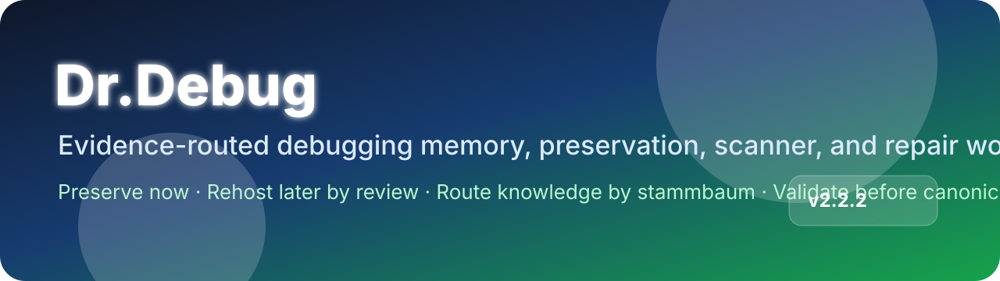
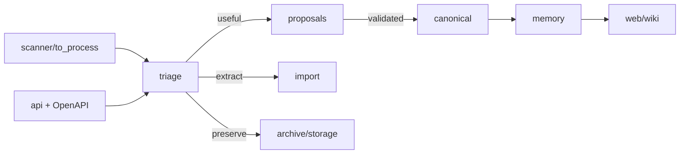

  

# Dr.Debug

**Dr.Debug** is a GitHub organization for building an evidence-routed debugging knowledge base across devices, software stacks, files, manuals, scanners, preservation records, imports, proposals, canonical facts, workflows, and GPT-backed API actions.

> Preserve artifacts while they are still available. Rehost only after review. Keep version, hardware, dependency, and evidence scope attached to every claim.

## Fast navigation

| Area | Repository | Purpose |
|---|---|---|
| Global agent instructions | [`doktor-debug/agents`](https://github.com/doktor-debug/agents) | Shared mode rules, routing, scanner routines, preservation rules, and response discipline. |
| Textual debug memory | [`doktor-debug/memory`](https://github.com/doktor-debug/memory) | Error explanations, validated workflows, device/software knowledge, source records, and fact lifecycle. |
| Visual/manual/media memory | [`doktor-debug/web`](https://github.com/doktor-debug/web) | GitHub Pages renderers, manuals, media metadata, HTML/CSS/JS, and visual knowledge. |
| GPT backend API | [`doktor-debug/api`](https://github.com/doktor-debug/api) | Local/admin API mirror, OpenAPI, gates, policy routing, and controlled GitHub writes. |
| Standalone wiki | [`doktor-debug/wiki`](https://github.com/doktor-debug/wiki) | Human-readable documentation portal with TOC, architecture pages, and GitHub Pages output. |
| Archive & preservation | [`doktor-debug/archive`](https://github.com/doktor-debug/archive) | Immediate preservation manifests, source records, file metadata, and deadlink candidates. |
| Scanner intake | [`doktor-debug/scanner`](https://github.com/doktor-debug/scanner) | Files uploaded for analysis, routing, triage, and later cleanup. |
| Proposals | [`doktor-debug/proposals`](https://github.com/doktor-debug/proposals) | Mode-safe knowledge proposals and canonicalization requests. |
| Imports | [`doktor-debug/import`](https://github.com/doktor-debug/import) | PDF/code/dependency/text extraction plans and import reports. |
| Canonical facts | [`doktor-debug/canonical`](https://github.com/doktor-debug/canonical) | Reviewed canonical knowledge, superseded facts, conflicts, and lineage. |
| Workflows | [`doktor-debug/workflows`](https://github.com/doktor-debug/workflows) | Batch, import, migration, validation, and rollback orchestration. |
| Storage | [`doktor-debug/storage`](https://github.com/doktor-debug/storage) | Git LFS/private preservation pointers and mirror metadata. |
| Research | [`doktor-debug/research`](https://github.com/doktor-debug/research) | Sources, claims, conflicts, rights review, and external evidence. |
| Taxonomy | [`doktor-debug/taxonomy`](https://github.com/doktor-debug/taxonomy) | Device, software, ECLASS, dependency, and stammbaum classification. |

## Operating model

<strong>Mode summary</strong>

| Mode | Main job | Write posture |
|---|---|---|
| `CUSTOMER_MODE` | Build knowledge, proposals, scanner results, preservation records, and validated debug findings. | May write routed safe knowledge/proposal/preservation/staging paths. User assertions alone are not canonical truth. |
| `ADMIN_MODE` | Operate API, scanner, imports, workflow staging, repository routing, and validated structured writes. | May write broader operational paths after bearer auth, repo allowlist, path policy, redaction, and audit. |
| `OWNER_MODE` | Final review, release, canonical promotion, policy changes, migrations, and rehosting decisions. | Requires owner identity, reason, apply intent, rollback for risky changes, validation, and audit. |

## Documentation entry points

- [Profile TOC](./.INDEX.md)
- [TOC1 — Repositories](./TOC1.md)
- [TOC2 — Modes and gates](./TOC2.md)
- [TOC3 — Preservation and scanner lifecycle](./TOC3.md)
- [Standalone wiki repository](https://github.com/doktor-debug/wiki)

## Principles

1. **Source before claim** — prefer official or technical evidence, but do not treat vendors as infallible.
2. **Version before contradiction** — many “conflicts” are really device, firmware, dependency, runtime, or date differences.
3. **Preserve now, rehost later by review** — private preservation is not public file hosting.
4. **Propose before canonical** — allow knowledge growth without silently poisoning canonical memory.
5. **Supersede false knowledge** — Dr.Debug may correct previous knowledge when better evidence proves it wrong or out of scope.

---

This repository is intended to be named **`doktor-debug/.github`**. GitHub renders `profile/README.md` on the public organization profile.
