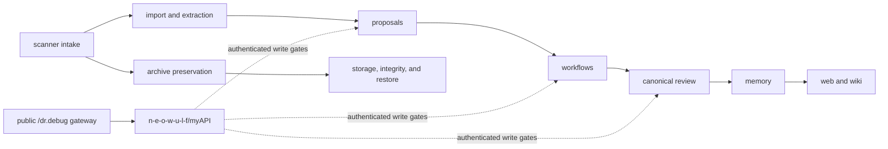

  

# Dr.Debug 2.4

**Dr.Debug** is a GitHub organization for building an evidence-routed debugging knowledge base across devices, software stacks, files, manuals, scanners, preservation records, imports, proposals, canonical facts, and reusable workflows.

> Preserve artifacts with provenance and integrity evidence. Distribute each item only under its recorded rights, safety, and review basis. Keep version, hardware, dependency, and evidence scope attached to every claim.

## Fast navigation

| Area | Repository | Purpose |
|---|---|---|
| Organization profile | [`doktor-debug/.github`](https://github.com/doktor-debug/.github) | Public organization overview, repository navigation, modes, and lifecycle entry points. |
| Global agent instructions | [`doktor-debug/agents`](https://github.com/doktor-debug/agents) | Shared mode rules, routing, scanner routines, preservation rules, and response discipline. |
| Textual debug memory | [`doktor-debug/memory`](https://github.com/doktor-debug/memory) | Accepted error explanations, device/software knowledge, source-backed diagnostics, and fact lifecycle. |
| Visual/manual/media memory | [`doktor-debug/web`](https://github.com/doktor-debug/web) | GitHub Pages renderers, manuals, media metadata, HTML/CSS/JS, and visual knowledge. |
| Standalone wiki | [`doktor-debug/wiki`](https://github.com/doktor-debug/wiki) | Human-readable documentation portal with TOC, architecture pages, and GitHub Pages output. |
| Archive & preservation | [`doktor-debug/archive`](https://github.com/doktor-debug/archive) | Active provenance catalog, preservation manifests, hashes, reviewed snapshots, and distribution decisions. |
| Scanner intake | [`doktor-debug/scanner`](https://github.com/doktor-debug/scanner) | Files uploaded for analysis, routing, triage, and later cleanup. |
| Proposals | [`doktor-debug/proposals`](https://github.com/doktor-debug/proposals) | Mode-safe knowledge proposals and canonicalization requests. |
| Imports | [`doktor-debug/import`](https://github.com/doktor-debug/import) | PDF/code/dependency/text extraction plans and import reports. |
| Canonical facts | [`doktor-debug/canonical`](https://github.com/doktor-debug/canonical) | Reviewed canonical knowledge, superseded facts, conflicts, and lineage. |
| Workflows | [`doktor-debug/workflows`](https://github.com/doktor-debug/workflows) | Batch, import, migration, validation, and rollback orchestration. |
| Storage | [`doktor-debug/storage`](https://github.com/doktor-debug/storage) | Active large/offline artifact storage, integrity checks, retention, restore metadata, and controlled delivery. |
| Research | [`doktor-debug/research`](https://github.com/doktor-debug/research) | Sources, claims, conflicts, rights review, and external evidence. |
| Taxonomy | [`doktor-debug/taxonomy`](https://github.com/doktor-debug/taxonomy) | Device, software, ECLASS, dependency, and stammbaum classification. |

The authenticated write control plane is the external private repository [`n-e-o-w-u-l-f/myAPI`](https://github.com/n-e-o-w-u-l-f/myAPI). It is not part of the `doktor-debug/*` content allowlist and does not replace repository-local instructions.

Public GPT Actions call `/dr.debug/*`. `/myapi/*` is reserved for internal or
loopback compatibility and is not advertised as a public route.

## Operating model

<strong>Mode summary</strong>

| Mode | Main job | Write posture |
|---|---|---|
| `CUSTOMER_MODE` | Diagnose, collect evidence, and prepare routed artifacts. | Writes require the control-plane gate; proposals go only to `proposals`, workflow artifacts only to `workflows`. User assertions alone are not canonical truth. |
| `ADMIN_MODE` | Operate scanner processing, imports, workflow staging, repository routing, and validated structured writes. | May write broader operational paths only after the external `myAPI` bearer-auth, repository, path, redaction, validation, and audit gates pass. |
| `OWNER_MODE` | Discover, read, index, summarize, and describe all fourteen repositories plus the external control plane; perform final review and coordinated changes. | Read/describe is non-mutating. Every write remains separately gated by `myAPI` and requires owner identity, reason, validation, audit, and rollback for risky changes. |

## Documentation entry points

- [TOC1 — Repositories](./TOC1.md)
- [TOC2 — Modes and gates](./TOC2.md)
- [TOC3 — Preservation and scanner lifecycle](./TOC3.md)
- [Standalone wiki repository](https://github.com/doktor-debug/wiki)

## Principles

1. **Source before claim** — prefer official or technical evidence, but do not treat vendors as infallible.
2. **Version before contradiction** — many “conflicts” are really device, firmware, dependency, runtime, or date differences.
3. **Preserve actively, distribute deliberately** — archive and storage preserve, verify, retain, restore, and deliver artifacts under an item-specific rights, provenance, integrity, safety, and review basis.
4. **Propose before canonical** — allow knowledge growth without silently poisoning canonical memory.
5. **Supersede false knowledge** — Dr.Debug may correct previous knowledge when better evidence proves it wrong or out of scope.

External Kodi, ShellRPG, and spinnenhain repositories are separate,
conditionally authorized project families. They do not expand the fourteen
repository OWNER_MODE discovery group unless their exact slug and backend
implementation state are verified.

---

This repository is intended to be named **`doktor-debug/.github`**. GitHub renders `profile/README.md` on the public organization profile.
